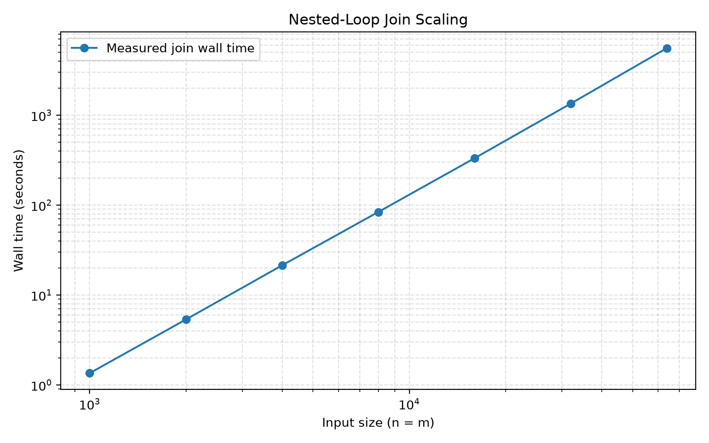

# Performance Report

## 1. Benchmark Environment

The relational algebra engine was implemented in Python and benchmarked on the following machine:

| Component | Specification |
|---|---|
| Processor | Apple M3 Max |
| Architecture | ARM64 |
| Operating system | macOS 26.6.2 (build 25G83) |
| Python version | 3.14.6 |

Wall-clock execution time was measured using `time.perf_counter()`. Relation generation and loading were completed before each query's timer started.

## 2. Benchmark Data

The benchmark generator creates two relations:

- `R(a, b)` with `n` tuples, where `a` is unique.
- `S(b, c)` with `m` tuples, where `c` is unique.

The join query is:

```text
R join[R.b = S.b] S
```

The generator controls the number of matching tuples by varying the number of distinct `b` values. The join-scaling experiment uses a match rate of 1 and sets `n = m`.

The selection and projection queries are:

```text
select[a >= 0](R)
project[a](R)
```

Both queries return all `n` generated tuples. The selection benchmark records the number of input tuples examined; the join benchmark records the number of tuple-pair comparisons.

### 2.1 Benchmark Result Files

The raw measurements used in this report are included with the project as CSV files:

- `performance_results.csv` — join scaling results for `n = m` from 1,000 to 64,000 tuples.
- `selection_results.csv` — selection measurements over the same seven input sizes.
- `projection_results.csv` — projection measurements over the same seven input sizes.
- `match_rate_results.csv` — join measurements with `n = m = 1,000` and match rates of 1, 2, 4, and 8.

The tables in Sections 3, 4, and 5 are based on these recorded measurements.

## 3. Join Scaling Results

The nested-loop join was benchmarked with `n = m` at seven input sizes. The match rate was fixed at 1, producing `n` output tuples in each experiment.

| n | m | Tuple-pair comparisons | Wall time (seconds) | Output tuples |
|---:|---:|---:|---:|---:|
| 1,000 | 1,000 | 1,000,000 | 1.351056 | 1,000 |
| 2,000 | 2,000 | 4,000,000 | 5.339250 | 2,000 |
| 4,000 | 4,000 | 16,000,000 | 21.371815 | 4,000 |
| 8,000 | 8,000 | 64,000,000 | 83.811201 | 8,000 |
| 16,000 | 16,000 | 256,000,000 | 331.713816 | 16,000 |
| 32,000 | 32,000 | 1,024,000,000 | 1,343.750869 | 32,000 |
| 64,000 | 64,000 | 4,096,000,000 | 5,566.991623 | 64,000 |

### 3.1 Comparison Count

The join uses a nested-loop algorithm. For every tuple in `R`, it examines every tuple in `S`, so the number of tuple-pair comparisons is:

```text
C(n, m) = n × m
```

When `n = m`, this becomes `C(n, n) = n²`. The measured comparison counts match this formula exactly at all seven input sizes.

### 3.2 Wall-Time Scaling

The measured log-log slope of join wall time against input size was **1.9976**, calculated using a least-squares fit across all seven measurements. This is close to the theoretical slope of 2 for quadratic growth.



The plot shows an approximately straight line on logarithmic axes. Doubling both input sizes increased the comparison count by a factor of four, and the measured wall time increased by approximately the same factor.

### 3.3 Extrapolation to One Million Tuples

Running the nested-loop join with `n = m = 1,000,000` would require:

```text
C(1,000,000, 1,000,000)
= 1,000,000 × 1,000,000
= 1,000,000,000,000 tuple-pair comparisons
```

The largest measured experiment used `n = m = 64,000` and took 5,566.992 seconds. Using this measurement and the fitted log-log slope of 1.9976, the predicted runtime is:

```text
T(1,000,000) ≈ T(64,000) × (1,000,000 / 64,000)^1.9976
             ≈ 1,350,187 seconds
             ≈ 375.05 hours
             ≈ 15.63 days
```

This is an extrapolation, not a measured result. It assumes that the runtime continues to scale at approximately the same rate beyond the tested input sizes. Changes in memory usage, system load, or other runtime overhead could affect the actual duration.

A join requiring approximately 15.63 days is not practical for interactive querying. The experiment demonstrates the scalability limitation of the implemented nested-loop algorithm at large input sizes.

## 4. Selection and Projection Results

Selection and projection were benchmarked on relation `R` using the same seven input sizes as the join experiment. Both queries returned all `n` tuples. The selection counter recorded one tuple examined for each input tuple.

| n | Selection tuples examined | Selection time (seconds) | Projection time (seconds) | Output tuples (each query) |
|---:|---:|---:|---:|---:|
| 1,000 | 1,000 | 0.082084 | 0.080813 | 1,000 |
| 2,000 | 2,000 | 0.325704 | 0.326623 | 2,000 |
| 4,000 | 4,000 | 1.238693 | 1.298519 | 4,000 |
| 8,000 | 8,000 | 4.925739 | 5.051245 | 8,000 |
| 16,000 | 16,000 | 20.654416 | 20.601660 | 16,000 |
| 32,000 | 32,000 | 85.656919 | 86.014534 | 32,000 |
| 64,000 | 64,000 | 329.971429 | 324.927452 | 64,000 |

### 4.1 Analysis

The selection counter increased linearly with input size: examining a relation of `n` tuples required exactly `n` tuple examinations. However, the measured wall times for both selection and projection increased by approximately four times whenever `n` doubled.

The counter measures the selection loop's input examinations, not every operation performed during query execution. The engine also constructs a result relation and enforces set semantics by checking for duplicate rows. These additional operations can contribute substantially to the measured runtime.

The selection and projection results therefore show an important distinction between **the number of input tuples examined** and **the total execution time of the current implementation**. Although the selection loop examines each input tuple once, the measured end-to-end query execution time grows approximately quadratically over the tested sizes.

## 5. Effect of Match Rate on Join Performance

To examine the effect of match rate, both input relations were held at 1,000 tuples while the number of matching output tuples was increased. The same nested-loop join query was used for every run.

| Match rate | n | m | Tuple-pair comparisons | Wall time (seconds) | Output tuples |
|---:|---:|---:|---:|---:|---:|
| 1 | 1,000 | 1,000 | 1,000,000 | 1.386174 | 1,000 |
| 2 | 1,000 | 1,000 | 1,000,000 | 1.553754 | 2,000 |
| 4 | 1,000 | 1,000 | 1,000,000 | 2.474367 | 4,000 |
| 8 | 1,000 | 1,000 | 1,000,000 | 6.178638 | 8,000 |

### 5.1 Analysis

The tuple-pair comparison count remained constant at 1,000,000 across all four runs because the nested-loop join examined every pair of input tuples regardless of whether the join condition matched.

Increasing the match rate increased the number of output tuples. Wall time also increased, from 1.386174 seconds at match rate 1 to 6.178638 seconds at match rate 8.

These results show that the comparison count alone does not determine total execution time. Producing and storing more matching tuples adds work, including the cost of constructing the result relation and enforcing set semantics. The measured wall times reflect both tuple-pair comparisons and this additional output-processing work.

## 6. Feasibility and Limitations

The engine successfully executed the required join benchmarks up to `n = m = 64,000`. At that size, the join performed 4,096,000,000 tuple-pair comparisons and took approximately 92.8 minutes. The measured log-log slope of 1.9976 is consistent with quadratic scaling when both input sizes increase together.

The estimated runtime for `n = m = 1,000,000` is 15.63 days on the benchmark machine. This makes the current nested-loop join unsuitable for interactive queries at that scale. The estimate is based on extrapolation rather than a completed million-tuple experiment.

Selection and projection examined or processed substantially fewer input tuples than the join, but their measured wall times also grew approximately quadratically over the tested sizes. Result-relation construction and duplicate checking are likely contributors to this behavior.

The benchmarks have several limitations. Each configuration was timed once, so the results do not quantify run-to-run variation. The generated data follows a regular pattern rather than representing a broad range of real-world datasets. The reported wall times exclude data generation and relation loading, and the extrapolation assumes that the measured scaling trend continues beyond 64,000 tuples.

Overall, the engine demonstrates correct execution and measurable performance behavior on the tested inputs, while the results identify scalability limits in the current implementation.